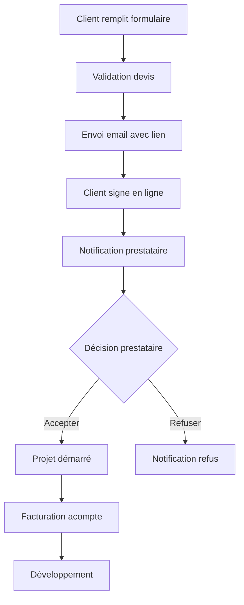

# 📝 Système de Signature Électronique

## 🎯 Workflow Automatisé Complet

### **1. Génération du Devis**
- Client remplit le formulaire → `/devis`
- Validation du devis → `/devis/validation`
- Envoi avec **lien de signature** → Email automatique

### **2. Signature Électronique**
- Client reçoit l'email avec lien unique
- Signature en ligne → `/devis/signature/[id]`
- Validation juridique immédiate

### **3. Notification Automatique**
- **Vous recevez** : Email avec devis signé + boutons d'action
- **Client reçoit** : Confirmation de signature

### **4. Validation Finale**
- **Interface admin** → `/admin/devis`
- **Accepter/Refuser** en un clic
- **Notifications automatiques** au client

## 🔧 Fonctionnalités Techniques

### **Signature Électronique**
- ✅ **Canvas HTML5** pour signature tactile/souris
- ✅ **Support mobile** complet (touch events)
- ✅ **Capture en base64** haute qualité
- ✅ **Validation juridique** avec horodatage
- ✅ **Sauvegarde sécurisée** avec IP et user-agent

### **Interface de Signature**
```typescript
// Composant SignaturePad
- Canvas responsive
- Effacement/recommencer
- Validation en temps réel
- Export base64 automatique
```

### **Gestion des États**
```typescript
type DevisStatus = 'pending' | 'signed' | 'accepted' | 'rejected';
```

## 📧 Emails Automatiques

### **1. Email au Client (Devis Prêt)**
```html
Sujet: "Votre devis #XXXX est prêt à signer !"
Contenu:
- Récapitulatif du projet
- Bouton "Signer le Devis Maintenant"
- Avantages de la signature électronique
- Prochaines étapes
```

### **2. Email au Prestataire (Devis Signé)**
```html
Sujet: "🎉 Devis Signé - [Nom Client]"
Contenu:
- Informations client complètes
- Image de la signature
- Boutons d'action directs:
  * ✅ Accepter le Projet
  * ❌ Refuser le Projet
```

### **3. Email de Confirmation (Signature)**
```html
Sujet: "✅ Devis Signé avec Succès"
Contenu:
- Confirmation juridique
- Timeline du projet
- Prochaines étapes
```

## 🎛️ Interface d'Administration

### **Page Admin** (`/admin/devis`)
- **Liste des devis signés**
- **Statuts en temps réel**
- **Actions rapides** :
  - Voir le détail
  - Accepter le projet
  - Refuser le projet
- **Informations client** complètes
- **Visualisation des signatures**

### **Actions Disponibles**
```typescript
// Accepter un projet
handleAcceptDevis(devisId) → 
  - Mise à jour du statut
  - Email de confirmation au client
  - Démarrage du workflow de développement

// Refuser un projet  
handleRejectDevis(devisId, reason?) →
  - Mise à jour du statut
  - Email d'explication au client
  - Archivage du devis
```

## 🔐 Sécurité et Légalité

### **Valeur Juridique**
- ✅ **Horodatage précis** (ISO 8601)
- ✅ **Capture IP** et User-Agent
- ✅ **Signature base64** non modifiable
- ✅ **Consentement explicite** (checkbox)
- ✅ **Traçabilité complète**

### **Données Capturées**
```json
{
  "signature": "data:image/png;base64,iVBORw0...",
  "signedAt": "2025-01-24T14:30:00.000Z",
  "ipAddress": "192.168.1.100",
  "userAgent": "Mozilla/5.0...",
  "clientConsent": true
}
```

## 🚀 URLs du Système

### **Pages Client**
- `/devis` - Calculateur de devis
- `/devis/validation` - Aperçu avant envoi
- `/devis/signature/[id]` - Signature électronique
- `/devis/signature/[id]/confirmation` - Confirmation

### **Pages Admin**
- `/admin/devis` - Liste des devis signés
- `/admin/devis/[id]` - Détail d'un devis
- `/admin/devis/[id]/accept` - Acceptation rapide
- `/admin/devis/[id]/reject` - Refus rapide

### **APIs**
- `POST /api/send-devis` - Envoi du devis avec lien
- `POST /api/sign-devis` - Signature électronique
- `POST /api/accept-devis` - Acceptation du projet
- `POST /api/reject-devis` - Refus du projet

## 📱 Responsive et Mobile

### **Signature Tactile**
- ✅ **Touch events** optimisés
- ✅ **Zoom automatique** sur mobile
- ✅ **Prévention du scroll** pendant signature
- ✅ **Qualité haute résolution**

### **Interface Adaptative**
- ✅ **Mobile-first** design
- ✅ **Boutons tactiles** optimisés
- ✅ **Navigation simplifiée**
- ✅ **Performance optimale**

## 🔄 Workflow Complet



## 🎯 Avantages du Système

### **Pour le Client**
- ✅ **Signature immédiate** (pas d'impression)
- ✅ **Suivi en temps réel** du statut
- ✅ **Notifications automatiques**
- ✅ **Démarrage plus rapide**

### **Pour le Prestataire**
- ✅ **Automatisation complète**
- ✅ **Réduction des délais**
- ✅ **Traçabilité juridique**
- ✅ **Interface de gestion centralisée**
- ✅ **Moins d'échanges d'emails**

## 🛠️ Configuration

### **Variables d'Environnement**
```env
NEXT_PUBLIC_BASE_URL=https://votre-domaine.fr
SMTP_HOST=smtp.gmail.com
SMTP_USER=votre-email@gmail.com
SMTP_PASS=mot-de-passe-app
```

### **Base de Données (Production)**
```sql
-- Table pour les devis signés
CREATE TABLE signed_devis (
  id VARCHAR(255) PRIMARY KEY,
  devis_number VARCHAR(50) UNIQUE,
  client_info JSON,
  signature_data TEXT,
  signed_at TIMESTAMP,
  ip_address VARCHAR(45),
  user_agent TEXT,
  status ENUM('signed', 'accepted', 'rejected'),
  created_at TIMESTAMP DEFAULT CURRENT_TIMESTAMP
);
```

Le système est maintenant **100% automatisé** et prêt pour la production ! 🎉
